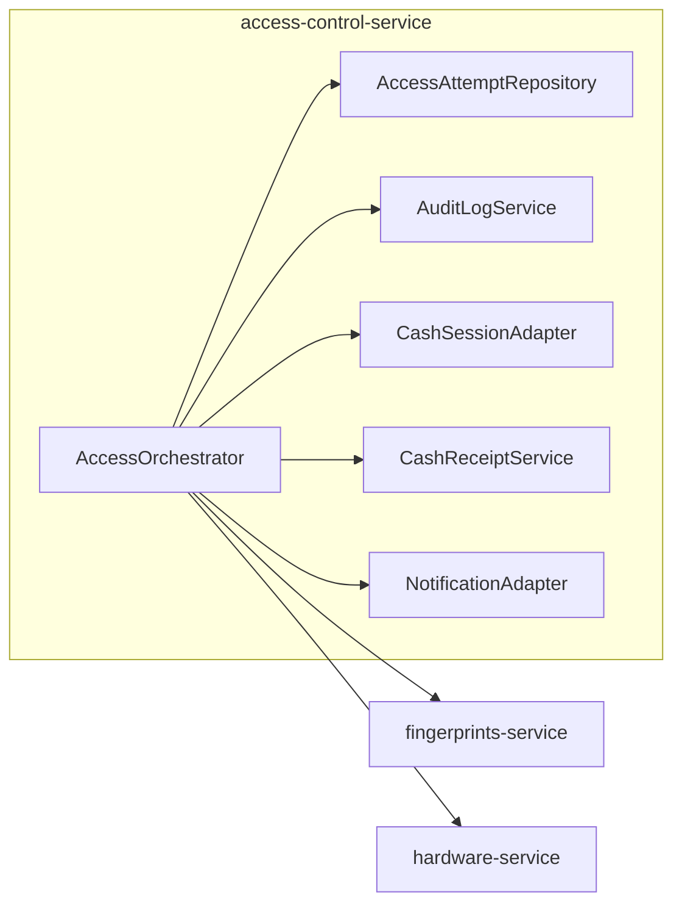

# SDS: Access Attempt Saga

Software Design Specification for the access-attempt saga with compensation.

Related: [ADR-001](./ADR-001-access-attempt-saga.md) · [state-machine](./state-machine.md) · [sequences](./sequences.md) · [data-model](./data-model.md) · [api-contracts](./api-contracts.md)

---

## 1. Goals and non-goals

### Goals

- Never leave a visitor permanently charged when the door fails to open.
- Persist every attempt (UUID) before any charge.
- Idempotent charge and refund.
- Door success only after positive confirmation; configurable retries/timeouts.
- Automatic compensation; escalate to `MANUAL_REVIEW` if compensation fails.
- Cover chip, fingerprint, and cash (cash via staff receipt).

### Non-goals (v1)

- Proving a person physically walked through the gate.
- Physical coin returner / change dispenser.
- XA / 2PC across services.
- Card top-up (Nedarim) — separate flow; only entrance fee saga here.

---

## 2. Architecture

Logical roles map onto existing deployables:

| Logical role | Responsibility | Physical home |
|--------------|----------------|---------------|
| AccessOrchestrator (Saga) | Create attempt, drive state machine, retries, compensation | `access-control-service` |
| AccessAttemptRepository | Persist attempts + CAS transitions | Postgres `access_control` |
| LedgerPort | Idempotent chip/FP balance charge & refund | `fingerprints-service` via HTTP adapter |
| CashSessionPort | Atomic cash take / best-effort restore | In-process over redesigned `CashSession` |
| CashReceiptPort | Issue staff-redeemable receipt | New module in ACS |
| DoorPort | Open door; wait for confirmation | `hardware-service` (API upgrade) |
| AuditLogPort | Append-only transition audit | Postgres + structured logs |
| NotificationPort | Dashboard events + alerts | Redis `access.events` / `access.alerts` |

**SOLID:** Orchestrator owns flow only. Each port is one infrastructure concern (DIP). Implementations are injected adapters.

**Identity:** No User table. Audit “UserId” field = `subject_ref` (`chip_id`, `uid`, or `cash`).

---

## 3. Method-specific behavior

### Chip / fingerprint (balance)

1. After staff approval (fingerprint only) or RFID scan (chip), create attempt `CREATED`.
2. Validate chip enabled + balance ≥ fee → `VALIDATED`.
3. `ILedgerPort.charge` with `idempotency_key=access-charge:{attempt_id}` → `CHARGED`.
4. Door saga → `COMPLETED` or compensation via `ILedgerPort.refund` with `access-refund:{attempt_id}`.

Fingerprint pending approval stays **outside** the saga: approve starts the attempt; cancel/timeout never charges.

### Cash

1. Coins accumulate in `CashSession` (unchanged product UX until fee reached).
2. When fee reachable, create attempt, validate → `VALIDATED`.
3. `ICashLedgerPort.take_fee(attempt_id, fee)` atomic → `CHARGED`. Overpayment above the fee is **discarded** from the live session (balance → 0); it is not change for the next customer.
4. On door failure: `restore_fee` (best-effort, fee amount only) + `ICashReceiptPort.issue` → `REFUNDED` when receipt is issued.
5. Staff redeems receipt from till in management UI (`issued` → `redeemed`).
6. Successful chip/fingerprint entry clears any abandoned partial cash via `clear_for_other_method`.

Receipt is the **authoritative** cash compensation. Session restore may fail if more coins arrived; staff still pays out via receipt.

---

## 4. Door confirmation

Today: `POST /door/open` returns 204 and unlocks in `create_task` — insufficient.

**Target:**

1. ACS records `door_operations` row and calls DoorPort with `operation_id` + `attempt_id`.
2. Hardware executes relay unlock.
3. Success = confirmed unlock command completed without error within `DOOR_OPEN_TIMEOUT_MS`.
4. Preferred v1: synchronous HTTP response after GPIO open call succeeds.
5. Stronger later: await Redis `door.opened` / `door.failed` correlated by `operation_id`.

“Relay commanded” ≠ “person walked through”. Saga guarantees **monetary** consistency with **command confirmation**.

Retries: up to `DOOR_MAX_RETRIES`, delay `DOOR_RETRY_DELAY_MS`, each try audited; then `door_exhausted` → `FAILED`.

---

## 5. Idempotency

### Chip charge / refund

| Operation | Key |
|-----------|-----|
| Charge | `access-charge:{attempt_id}` |
| Refund | `access-refund:{attempt_id}` |

`fingerprints-service` unique index on `chip_activity.idempotency_key` returns current balance on replay without a second debit/credit.

ACS also stores `payment_transactions` / `refund_transactions` with UNIQUE `idempotency_key` and CAS so concurrent workers do not double-call.

### Cash take

`take_fee` binds `cash_taken_for_attempt_id`. Second take for the same attempt is a no-op success.

### Cash receipt

One receipt per `attempt_id` (UNIQUE FK). Re-issue returns the same receipt.

---

## 6. Logging

Every state transition via `IAuditLogPort.append`:

| Field | Source |
|-------|--------|
| Timestamp | UTC now |
| AttemptId | `attempt.id` |
| UserId (subject) | `subject_ref` |
| Old State | previous status |
| New State | new status |
| Reason | machine reason code |
| Execution Duration | ms since previous transition or operation start |
| CorrelationId | `correlation_id` |

Mirror the same fields in structured application logs.

---

## 7. Alerts

| Alert | When | Payload must include |
|-------|------|----------------------|
| DoorFailedAfterCharge | Enter `REFUND_PENDING` after charge | `attempt_id`, method, fee, door errors |
| RefundFailed | `REFUND_PENDING` → `MANUAL_REVIEW` | `attempt_id`, last error, chip/receipt ids |
| DoorTimeout | Per-try timeout | `attempt_id`, attempt index, timeout_ms |
| HardwareUnavailable | Door port unreachable/error | `attempt_id`, endpoint error |
| RepeatedFailures | N failures in window | counts, last attempt ids |
| CashReceiptIssued | Cash compensation issued | `redeem_code`, amount (for staff) |

Dashboard: alert toast + management queues for `MANUAL_REVIEW` and unredeemed receipts.

---

## 8. Failure analysis

| Scenario | Expected behavior | Recovery | Final state |
|----------|-------------------|----------|-------------|
| DB down before create | No charge | Retry request | No attempt / client error |
| DB down after charge | Idempotent charge key exists | Reconciler resumes | `COMPLETED` or `REFUNDED` |
| Door relay timeout | Retries then fail | Auto refund/receipt | `REFUNDED` or `MANUAL_REVIEW` |
| Pi reboot mid-open | Stale `DOOR_OPENING` | Startup reconciler | Refund path |
| Chip unavailable on charge | `VALIDATED` → `FAILED` never charged | User retries | `FAILED` |
| Chip unavailable on refund | Alert | Staff resolve | `MANUAL_REVIEW` → `REFUNDED` |
| Duplicate scan / double-click | Same `hardware_event_id` or in-flight attempt | Ignore / return existing | Unchanged |
| Lost HTTP response after charge | Retry same attempt; charge idempotent | Continue door | `COMPLETED` / `REFUNDED` |
| Network blip to hardware | Door retry policy | As door policy | As above |
| Power loss after cash take | Attempt `CHARGED` in DB | Reconciler issues receipt | `REFUNDED` |
| Cash restore after new coins | Receipt is source of truth | Staff redeems receipt | `REFUNDED` |

**Reconciler:** periodic (and on startup) for states in `{CHARGED, DOOR_OPENING, REFUND_PENDING}` older than `STALE_ATTEMPT_SECONDS`. Never open the door if status is already `COMPLETED`, `REFUNDED`, or `MANUAL_REVIEW`.

---

## 9. Configuration

| Parameter | Purpose | Suggested default |
|-----------|---------|-------------------|
| `DOOR_OPEN_TIMEOUT_MS` | Per-try wait for confirm | 3000 |
| `DOOR_MAX_RETRIES` | Max open attempts | 2 |
| `DOOR_RETRY_DELAY_MS` | Backoff between tries | 500 |
| `DOOR_UNLOCK_SECONDS` | Relay hold (existing) | 5 |
| `REFUND_TIMEOUT_MS` | Ledger/receipt call timeout | 5000 |
| `REFUND_MAX_RETRIES` | Refund/receipt retries | 3 |
| `MAX_SAGA_DURATION_MS` | Wall-clock abort → `MANUAL_REVIEW` | 30000 |
| `STALE_ATTEMPT_SECONDS` | Reconciler threshold | 60 |
| `REPEATED_FAILURE_THRESHOLD` | Alert threshold | 5 / 10 min |
| `CASH_RECEIPT_CODE_BYTES` | Redeem code entropy | 8 |

---

## 10. Security

- **Replay:** attempt UUID once; charge/refund keys bound to `attempt_id`; optional TTL on stuck `CREATED`.
- **Duplicates:** unique `hardware_event_id` / correlation; CAS transitions; idempotent ledger.
- **Unauthorized refunds:** ledger refund only from ACS on the internal network; management resolve + receipt redeem require management PIN/JWT; redeem codes high-entropy and single-use.
- **Receipt fraud:** amount fixed to `attempt.fee_cents`; void + audit trail; redeem marks single-use.

---

## 11. Observability

- Audit table is the system of record for transitions.
- Redis events for UI: existing `access.*` plus alert channel.
- Metrics (later): attempts by status, door confirm latency, refund success rate, MANUAL_REVIEW count.
