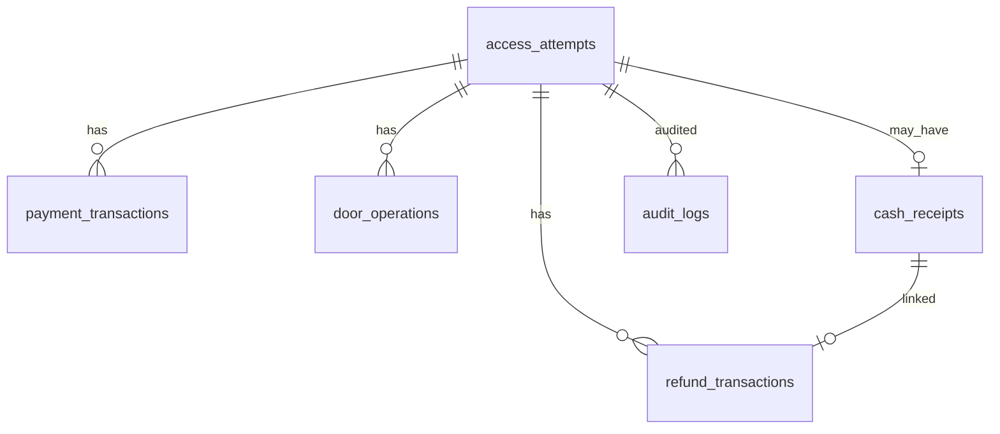

# Data Model — Access Attempt Saga

Schema: `access_control` (PostgreSQL). Extends beyond today’s `access_logs` / `hardware_events`.

All monetary amounts are **agorot** (cents). Timestamps are `timestamptz`.

---

## Enumerations

| Name | Values |
|------|--------|
| `attempt_method` | `chip`, `fingerprint`, `cash` |
| `attempt_status` | `CREATED`, `VALIDATED`, `CHARGED`, `DOOR_OPENING`, `COMPLETED`, `FAILED`, `REFUND_PENDING`, `REFUNDED`, `MANUAL_REVIEW` |
| `payment_status` | `pending`, `succeeded`, `failed` |
| `door_op_status` | `requested`, `confirmed`, `timeout`, `error` |
| `receipt_status` | `issued`, `redeemed`, `void` |
| `ledger_provider` | `chip`, `cash`, `cash_receipt` |

---

## `access_attempts`

| Column | Type | Notes |
|--------|------|-------|
| `id` | UUID PK | AccessAttemptId |
| `correlation_id` | UUID NOT NULL | Request/event id (may equal `id`) |
| `method` | `attempt_method` NOT NULL | |
| `subject_type` | text NOT NULL | e.g. `member_id`, `uid`, `cash` |
| `subject_ref` | text NOT NULL | chip UUID string, uid, or `cash` |
| `member_id` | UUID NULL | When applicable |
| `uid` | text NULL | When applicable |
| `status` | `attempt_status` NOT NULL | CAS target |
| `fee_cents` | int NOT NULL | |
| `door_attempt_count` | int NOT NULL DEFAULT 0 | |
| `failure_reason` | text NULL | |
| `charge_taken` | boolean NOT NULL DEFAULT false | Drives compensation path |
| `hardware_event_id` | text NULL | Dedup scan/coin event |
| `receipt_id` | UUID NULL FK → `cash_receipts.id` | |
| `created_at` | timestamptz NOT NULL | |
| `updated_at` | timestamptz NOT NULL | |

**Indexes**

- `(status, updated_at)` — reconciler
- UNIQUE `(hardware_event_id)` WHERE NOT NULL — duplicate event prevention
- `(uid, status)` WHERE status IN active states — in-flight guard (optional)

---

## `payment_transactions`

| Column | Type | Notes |
|--------|------|-------|
| `id` | UUID PK | |
| `attempt_id` | UUID NOT NULL FK → `access_attempts.id` | |
| `direction` | text NOT NULL | `charge` |
| `amount_cents` | int NOT NULL | |
| `status` | `payment_status` NOT NULL | |
| `provider` | `ledger_provider` NOT NULL | `chip` or `cash` |
| `idempotency_key` | text NOT NULL UNIQUE | `access-charge:{attempt_id}` |
| `correlation_id` | UUID NOT NULL | |
| `provider_ref` | text NULL | External activity id if any |
| `error_code` | text NULL | |
| `created_at` | timestamptz NOT NULL | |
| `updated_at` | timestamptz NOT NULL | |

---

## `refund_transactions`

| Column | Type | Notes |
|--------|------|-------|
| `id` | UUID PK | |
| `attempt_id` | UUID NOT NULL FK → `access_attempts.id` | |
| `direction` | text NOT NULL | `refund` |
| `amount_cents` | int NOT NULL | |
| `status` | `payment_status` NOT NULL | |
| `provider` | `ledger_provider` NOT NULL | `chip` or `cash_receipt` |
| `idempotency_key` | text NOT NULL UNIQUE | `access-refund:{attempt_id}` |
| `receipt_id` | UUID NULL FK → `cash_receipts.id` | Cash path |
| `correlation_id` | UUID NOT NULL | |
| `error_code` | text NULL | |
| `created_at` | timestamptz NOT NULL | |
| `updated_at` | timestamptz NOT NULL | |

---

## `door_operations`

| Column | Type | Notes |
|--------|------|-------|
| `id` | UUID PK | Passed to hardware as `operation_id` |
| `attempt_id` | UUID NOT NULL FK → `access_attempts.id` | |
| `attempt_index` | int NOT NULL | 1-based retry index |
| `status` | `door_op_status` NOT NULL | |
| `correlation_id` | UUID NOT NULL | |
| `error_code` | text NULL | |
| `started_at` | timestamptz NOT NULL | |
| `finished_at` | timestamptz NULL | |
| `created_at` | timestamptz NOT NULL | |
| `updated_at` | timestamptz NOT NULL | |

**Indexes:** `(attempt_id, attempt_index)` UNIQUE.

---

## `cash_receipts`

| Column | Type | Notes |
|--------|------|-------|
| `id` | UUID PK | |
| `attempt_id` | UUID NOT NULL UNIQUE FK → `access_attempts.id` | One receipt per attempt |
| `amount_cents` | int NOT NULL | Equals attempt fee |
| `redeem_code` | text NOT NULL UNIQUE | High entropy |
| `status` | `receipt_status` NOT NULL | |
| `issued_at` | timestamptz NOT NULL | |
| `redeemed_at` | timestamptz NULL | |
| `redeemed_by` | text NULL | Staff identity |
| `voided_at` | timestamptz NULL | |
| `correlation_id` | UUID NOT NULL | |
| `created_at` | timestamptz NOT NULL | |
| `updated_at` | timestamptz NOT NULL | |

---

## `audit_logs`

Append-only.

| Column | Type | Notes |
|--------|------|-------|
| `id` | bigserial PK | |
| `attempt_id` | UUID NOT NULL | |
| `correlation_id` | UUID NOT NULL | |
| `subject_ref` | text NOT NULL | Audit “UserId” |
| `old_status` | text NULL | Null on create |
| `new_status` | text NOT NULL | |
| `reason` | text NOT NULL | |
| `duration_ms` | int NULL | |
| `created_at` | timestamptz NOT NULL | |

**Indexes:** `(attempt_id, created_at)`, `(created_at)`.

---

## Legacy

| Table | Fate |
|-------|------|
| `access_logs` | Keep as denormalized summary written on terminal states, or migrate in a later phase |
| `hardware_events` | Unchanged raw ingest log |

---

## Entity relationship (logical)

