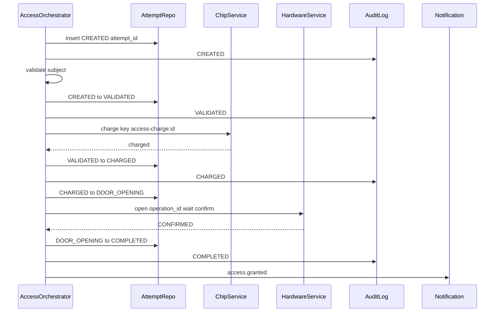
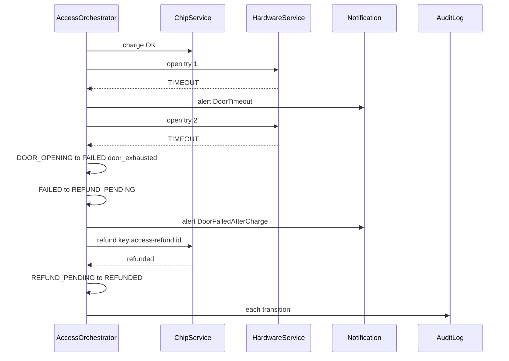
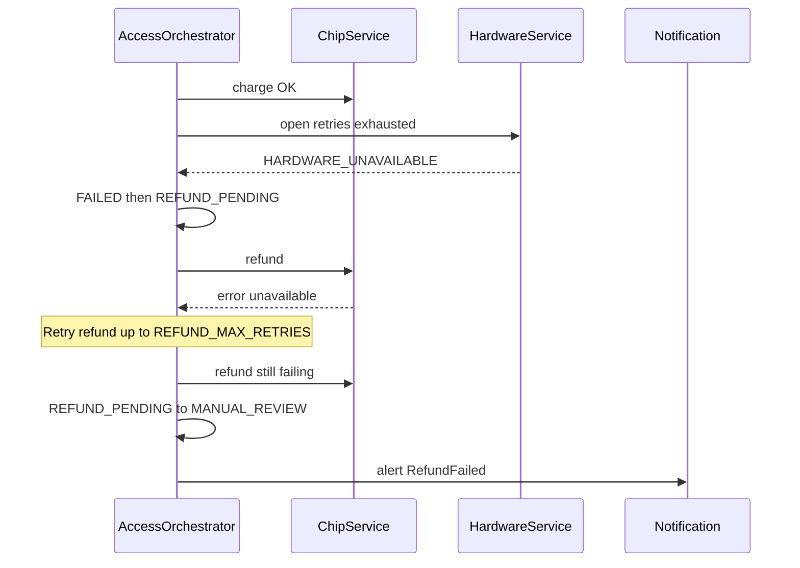
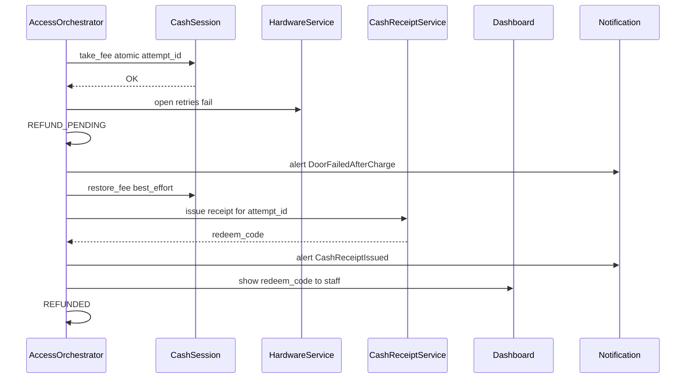
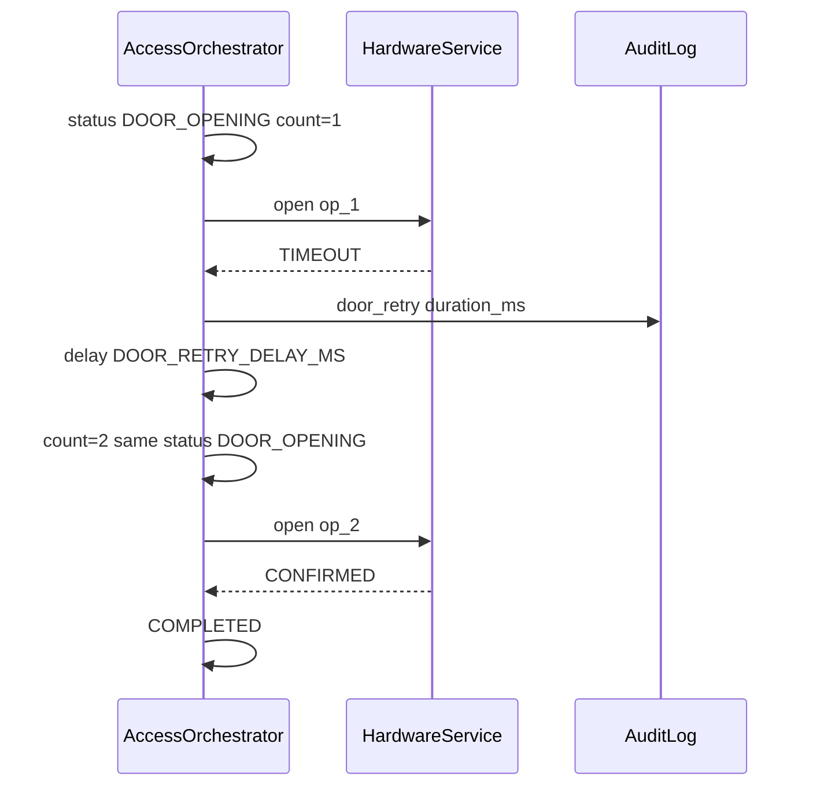
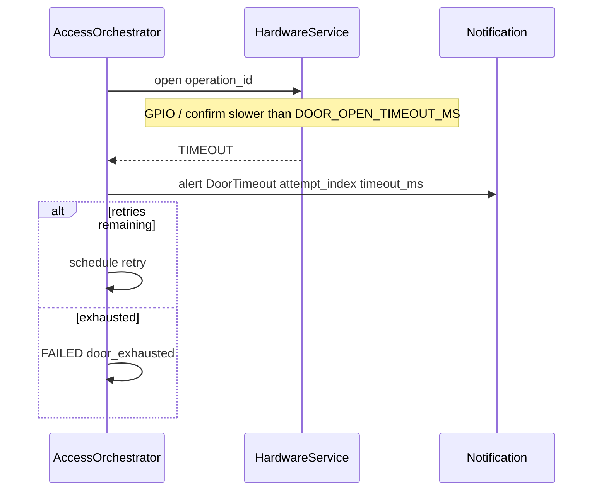
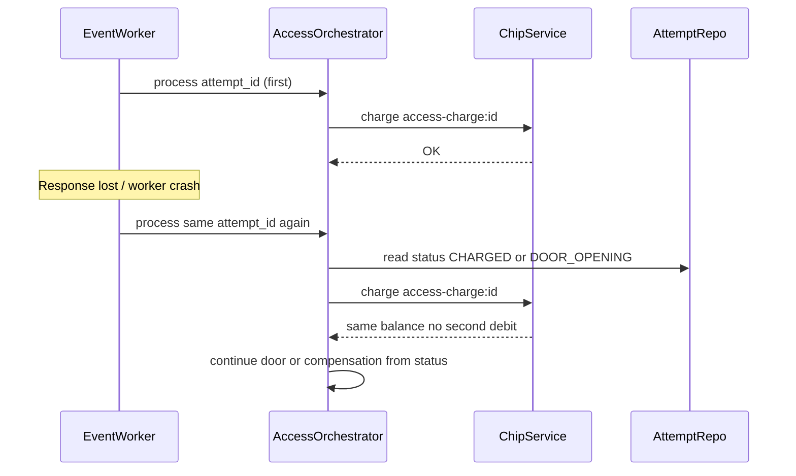

# Sequence Diagrams — Access Attempt Saga

Companion to [SDS](./SDS-access-attempt-saga.md) and [state-machine](./state-machine.md).

---

## 1. Successful access (chip / fingerprint)



---

## 2. Door failure → balance refund success



---

## 3. Door failure → refund failure → MANUAL_REVIEW



Staff later: `POST .../resolve` → `REFUNDED`.

---

## 4. Cash path — door failure → receipt issued



If `issue` fails after retries → `MANUAL_REVIEW` + `RefundFailed`.

---

## 5. Door retry flow



Parameters: `DOOR_OPEN_TIMEOUT_MS`, `DOOR_MAX_RETRIES`, `DOOR_RETRY_DELAY_MS`.

---

## 6. Door timeout (single try detail)



---

## 7. Duplicate request / lost response after charge



---

## 8. Successful cash access (happy path)

```mermaid
sequenceDiagram
  participant Orch as AccessOrchestrator
  participant Cash as CashSession
  participant Door as HardwareService

  Orch->>Orch: CREATED then VALIDATED
  Orch->>Cash: take_fee
  Cash-->>Orch: OK CHARGED
  Orch->>Door: open confirm
  Door-->>Orch: CONFIRMED
  Orch->>Orch: COMPLETED
  Note over Cash: Overpay discarded; session balance is 0 (not carried to next visitor)
```
