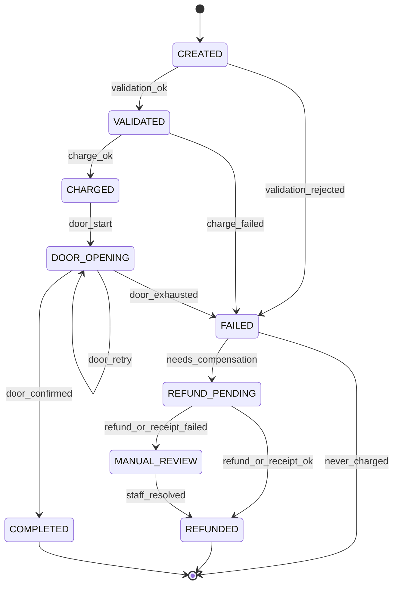

# State Machine — Access Attempt

Canonical lifecycle for one `AccessAttempt`. Transitions use optimistic CAS: update only if `status == expected_from`.

---

## States

| State | Meaning |
|-------|---------|
| `CREATED` | Row persisted; no charge yet |
| `VALIDATED` | Subject allowed to attempt payment |
| `CHARGED` | Fee taken (balance or cash session) |
| `DOOR_OPENING` | Door confirm in progress (may retry) |
| `COMPLETED` | Door confirmed; terminal success |
| `FAILED` | Flow failed; may or may not need compensation |
| `REFUND_PENDING` | Compensation in progress |
| `REFUNDED` | Balance refunded or cash receipt issued; terminal |
| `MANUAL_REVIEW` | Compensation failed; staff required |

---

## Diagram

Happy path: `CREATED` → `VALIDATED` → `CHARGED` → `DOOR_OPENING` → `COMPLETED`.

Compensation path: after charge + door failure → `FAILED` → `REFUND_PENDING` → `REFUNDED` (or `MANUAL_REVIEW`).

---

## Valid transitions

| From | To | Reason examples | Notes |
|------|----|-----------------|-------|
| `CREATED` | `VALIDATED` | `chip_ok`, `cash_enough`, `fp_approved` | |
| `CREATED` | `FAILED` | `unknown_chip`, `chip_disabled`, `insufficient_balance`, `invalid_amount` | `charge_taken=false` |
| `VALIDATED` | `CHARGED` | `ledger_charge_ok`, `cash_take_ok` | Set `charge_taken=true` |
| `VALIDATED` | `FAILED` | `insufficient_race`, `ledger_unavailable` | `charge_taken=false` |
| `CHARGED` | `DOOR_OPENING` | `door_request_sent` | First door try |
| `DOOR_OPENING` | `DOOR_OPENING` | `door_retry` | Increment `door_attempt_count` |
| `DOOR_OPENING` | `COMPLETED` | `door_confirmed` | Terminal |
| `DOOR_OPENING` | `FAILED` | `door_timeout`, `hardware_unavailable`, `door_exhausted` | |
| `FAILED` | `REFUND_PENDING` | `needs_compensation` | Only if `charge_taken` |
| `FAILED` | _(terminal)_ | `never_charged` | No further money ops |
| `REFUND_PENDING` | `REFUNDED` | `balance_refund_ok`, `cash_receipt_issued` | Terminal |
| `REFUND_PENDING` | `MANUAL_REVIEW` | `refund_failed`, `receipt_failed` | Alert |
| `MANUAL_REVIEW` | `REFUNDED` | `staff_marked_resolved` | Management auth |

`door_retry` keeps status `DOOR_OPENING` but still writes an audit row (old=new=`DOOR_OPENING`) and a new `door_operations` row.

---

## Invalid transitions

Must reject (conflict / no-op). Non-exhaustive list:

| From | To | Why illegal |
|------|----|-------------|
| `COMPLETED` | any | Terminal success |
| `REFUNDED` | `CHARGED` / `DOOR_OPENING` | Money already returned |
| `CREATED` | `COMPLETED` | Skips charge/door |
| `CREATED` | `CHARGED` | Skips validation |
| `VALIDATED` | `COMPLETED` | Skips charge/door |
| `REFUND_PENDING` | `DOOR_OPENING` | Do not open after compensation started |
| `FAILED` | `COMPLETED` | Cannot complete after fail without door confirm path |
| `MANUAL_REVIEW` | `DOOR_OPENING` | Staff resolve is monetary, not re-open |
| `CHARGED` | `REFUNDED` | Must pass `FAILED` / `REFUND_PENDING` for audit clarity |
| any → earlier happy-path state | e.g. `CHARGED`→`VALIDATED` | No rollback of status except via compensation states |

CAS mismatch (concurrent worker already moved status) → treat as conflict; re-read and continue or stop.

---

## Fingerprint approval boundary

Staff approval is **outside** this machine:

- Pending approval UI does not create `CHARGED` attempts.
- On approve → create attempt `CREATED` and run the saga.
- On cancel/timeout → no attempt charge (optional audit-only event).

---

## Reconciler rules

For stale `{CHARGED, DOOR_OPENING, REFUND_PENDING}`:

1. If `DOOR_OPENING` and under retry budget → retry door.
2. If retries exhausted → `FAILED` → compensation.
3. If `CHARGED` with no door ops → start door or compensate per policy (prefer try door once if within `MAX_SAGA_DURATION_MS`, else compensate).
4. If `REFUND_PENDING` → retry refund/receipt.
5. **Never** call DoorPort if status ∈ `{COMPLETED, REFUNDED, MANUAL_REVIEW}`.
